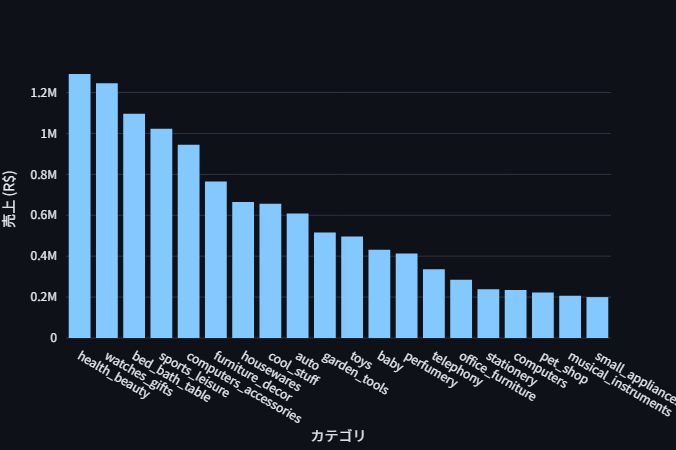
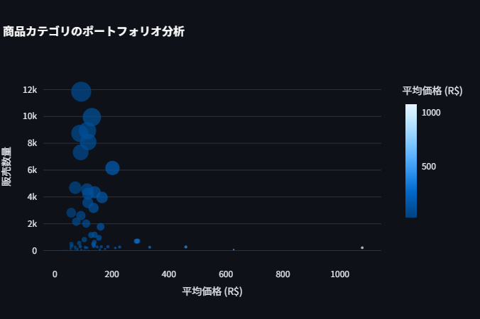
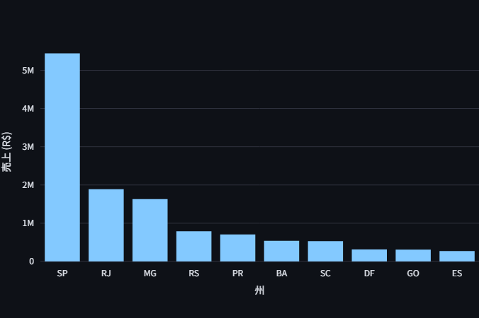
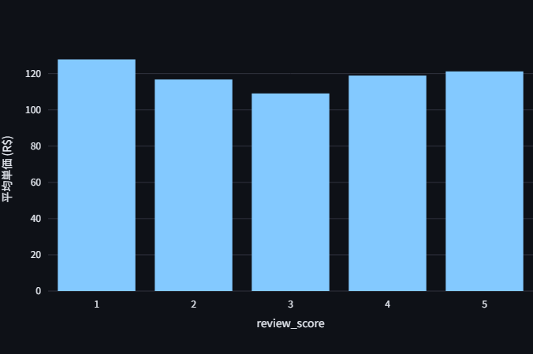
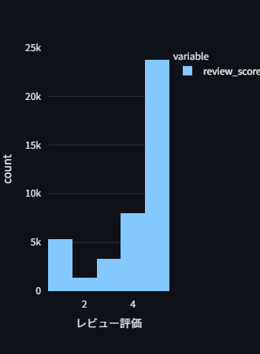
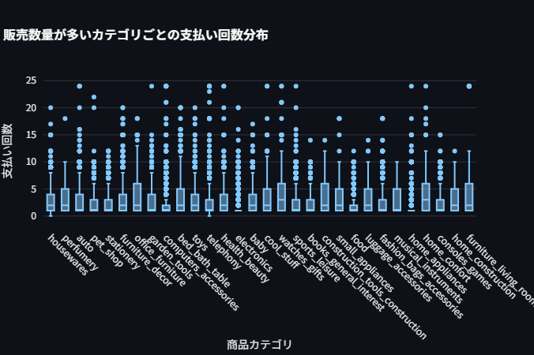
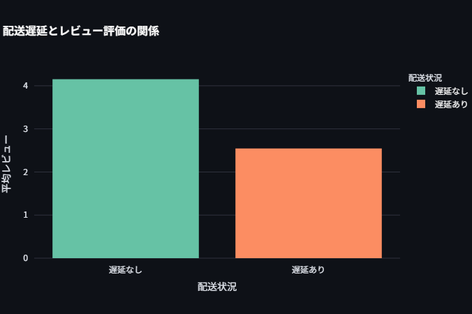
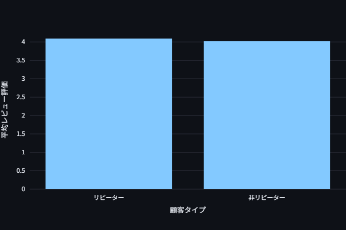
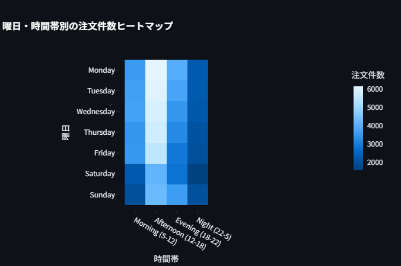
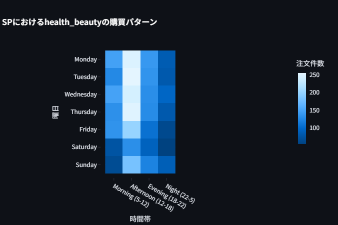

# olistデータ分析

この `README.md` ファイルは、ブラジルのEコマースプラットフォームであるOlistの公開データセットを分析したプロジェクトの概要をまとめたものです。データ分析の目的、使用したデータ、分析から得られたビジネス上の洞察、そしてOlist社への提言が記載されています。

## 目的
* **データ分析**: 設定されたビジネス上の課題（後述）に答えるための分析を行います。
* **Olist社への提言**: 分析結果に基づき、Olist社がビジネスを改善するための具体的な提案を行います。
## データセット
分析に用いるデータセットは以下の9つのcsv形式のファイルで顧客情報、注文情報、商品情報、支払い情報、レビュー情報などが含まれています。
* olist_customers_dataset

* olist_geolocation_dataset

* olist_orders_dataset

* olist_order_items_dataset

* olist_order_payments_dataset

* olist_products_dataset

* olist_sellers_dataset

* product_category_name_translation

* olist_order_reviews_dataset

##　データ分析の結果
* 売り上げはベッド・バス・テーブル用品」や「健康・美容」といった特定のカテゴリに依存している傾向が見られ、またバブルチャートを見てみると販売数は少ないが単価が高いニッチな群と、販売数は多いが単価が低い売れ筋群の存在がわかる。

* 売り上げはサンパウロ州(SP)などの特定の州に集中して地域によって売り上げの規模に大きな差がある。

* レビュー評価ごとの平均単価を比べると3が一番低く1,5が高水準にあり、これは単価が高いと期待が上がりすぎたことを示唆している。

* 100レアル以上の高価格商品の購入者のレビュー評価の分布は全体のレビュー評価の分布とさほど変わらない

* 販売数量の多い人気のカテゴリにおいて、ほとんどの場合、分割10回払い以下で払い終えていることから分割払いが購入の後押しになっている可能性。

*  実際の配達が配達予定日より遅れるとレビュー評価が大きく下がる。これは顧客満足度に与える最も大きな影響が配送品質である可能性

* 2回以上購入した人をリピーターとするとリピーターと非リピーターの平均レビュー評価はわずかにリピーターのほうが高いのでリピーターを育成する意義が見える

* リピーターの売り上げはそうでないほうと比べるとそこまで差があるわけではない

* ヒートマップ分析により、注文件数は平日の午後に最も集中する傾向があることがわかります。概ねの商品カテゴリ、顧客の居住地の組み合わせでも同じ傾向が見て取れます。

## Olist社への提言
### 提言1：配送プロセスの改善

**【背景】**
分析上、配送遅延は顧客満足度を最も毀損する要因です。これを放置することは、ブランドイメージの悪化と顧客離れに直結します。

**【具体的施策】**
* **配送状況のトラッキング**: 顧客がリアルタイムで詳細な配送状況を追跡できるシステムを追加し、不安を軽減します。
* **能動的なな顧客対応**: AIなどを活用して配送遅延を早期に予測し、遅延が発生しそうな場合は顧客に対して事前に通知とお詫び、および次回利用できるクーポンを提供するなどで評価の下降を最低限にとどめます。

### 提言2：顧客ロイヤリティ向上施策の導入

**【背景】**
分析で示された通り、満足した顧客はリピーターとなり、ビジネスの安定基盤となります。新規顧客獲得コストに比べ、既存顧客の維持・育成は費用対効果の高い投資です。

**【具体的施策】**
* **初回購入者へのフォローアップ**: 初回購入者に感謝の意を伝えると共に、次回使える限定クーポンを提供するなどして、2回目の購入へと繋げます。
* **リピーター限定特典の提供**: 購入回数や金額に応じたステージ制のロイヤルティプログラムを導入し、**「リピーターでいること」** の価値を高めます。限定セールへの先行招待や、配送料無料などが有効です。

---

### 提言3：データに基づいた効果的なマーケティング戦略

**【背景】**
カテゴリ特性や購買時間のパターンを活かすことで、マーケティング活動をより効率的かつ効果的に展開できます。

**【具体的施策】**
* **ピークタイムを狙った広告・販促**: 注文件数が最も多い平日の午後にタイムセールを実施したり、逆に注文件数が少ない時間帯の購買を促す限定クーポンを発行したりします。
* **詳細分析の活用**: 「カテゴリ・所在地別の詳細な購買パターン分析」機能を活用し、「サンパウロ州の顧客が週末の夜によく購入する特定カテゴリ」といったニッチな需要を発見し、ピンポイントで広告を配信します。

---

