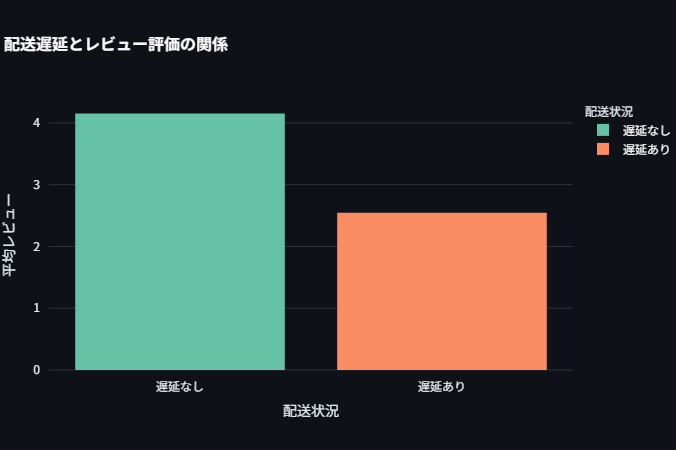
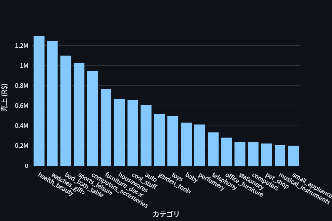
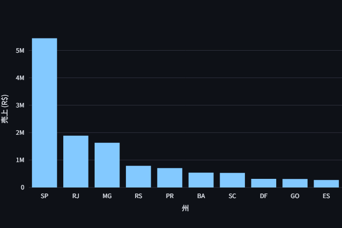
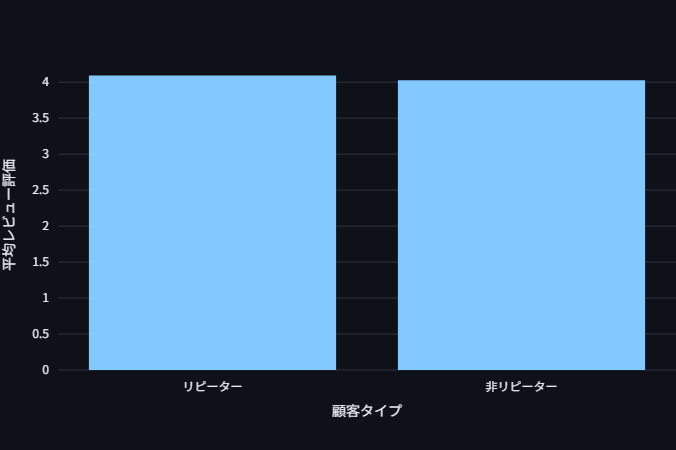
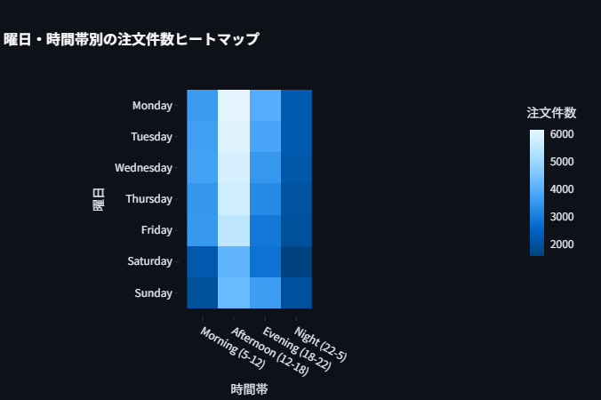

# olistデータ分析

この `README.md` ファイルは、ブラジルのEコマースプラットフォームである「Olist」の公開データセットを分析したプロジェクトの概要をまとめたものです。データ分析の目的、使用したデータ、分析から得られたビジネス上の洞察、そしてOlist社への提言が記載されています。

## 2. 解決すべきビジネス課題

本プロジェクトでは、Olist社が持続的な成長を遂げる上で直面するであろう、以下の主要なビジネス課題に焦点を当てました。

* **収益構造の最適化:** 売上は特定のカテゴリや地域に偏っていないか？新たな収益源となり得るニッチ市場は存在するか？
* **顧客満足度の向上:** 顧客体験を損なう要因は何か？特に、レビュー評価に大きな影響を与える要素は何か？
* **マーケティング効率の改善:** 広告やプロモーションは、最も効果的なタイミングとターゲットに届けられているか？

## 技術スタック
* **主要ライブラリ:**
    * **Streamlit:** インタラクティブなWebアプリケーション（ダッシュボード）の迅速な開発
    * **Pandas:** データクレンジング、前処理、結合、集計などのデータ操作
    * **Plotly Express:** 動的で美しいグラフ描画によるデータ可視化

## ダッシュボードの主な機能と特徴

ユーザー（ビジネス担当者）が直感的にデータを探索し、意思決定に繋げられるよう、以下の機能を実装しました。

* **KPIサマリー:** 総売上、総注文数、平均商品価格といった重要指標をひと目で把握。
* **インタラクティブな期間フィルター:** スライダー操作で分析対象期間を自由に変更し、期間ごとの深掘り分析が可能。
* **多角的なデータ可視化:**
    * 売上推移、カテゴリ別・地域別売上、レビュー評価分析など、多様な切り口からのグラフ表示。
    * マウスオーバーで詳細データが表示される直感的なチャート。
* **カテゴリポートフォリオ分析:** 販売数量と平均価格を軸にしたバブルチャートにより、「金のなる木」や「問題児」といったカテゴリ特性を視覚的に特定。
* **詳細ドリルダウン分析:** 特定の**商品カテゴリ**と**顧客の州**を掛け合わせることで、ニッチな購買パターンを発見。
* **パフォーマンス最適化:** Streamlitのキャッシュ機能 (`@st.cache_data`) を活用し、大規模なデータセットでも高速な再計算とスムーズな操作性を実現。

## 分析から得られた洞察

ダッシュボードを用いた分析により、以下の重要なビジネスインサイトが明らかになりました。

1.  **配送品質が顧客満足度の生命線**
    * **【事実】** 配達予定日からの**遅延は、レビュー評価の著しい低下に直結**しています。 
    * **【洞察】** 顧客は商品の質だけでなく、確実な配送体験を強く求めています。
    
2.  **売上の集中とニッチ市場の存在**
    * **【事実】** 売上は「ベッド・バス・テーブル用品」などの特定カテゴリや、サンパウロ州などの大都市圏に大きく依存しています。
    * **【洞察】** 収益源が偏っているリスクを抱える一方、バブルチャートからは**「単価は高いが販売数が少ない」ニッチカテゴリ群**の存在も確認でき、新たな成長機会の可能性を示しています。
    
    
3.  **リピーター育成の重要性**
    * **【事実】** リピーター顧客は、新規顧客に比べて**平均レビュー評価が高い**傾向にあります。
    * **【洞察】** 良好な関係を築けているリピーターは、安定した収益基盤となるだけでなく、ブランドの良き評判を広めるアンバサダーにもなり得ます。現状、リピーターが売上全体に占める割合はまだ大きくなく、育成する意義は非常に高いと考えられます。

4.  **効果的なマーケティングタイミング**
    * **【事実】** 購買活動は、特定の曜日や時間帯（特に**平日の午後**）に集中する明確なパターンが見られます。
    * **【洞察】** 購買が活発なピークタイムを狙ったアプローチにより、マーケティング効果を最大化できる可能性があります。
    


## Olist社への提言
### 提言1：配送プロセスの改善

**【背景】**
配送遅延による顧客満足度の低下

**【具体的施策】**
* **配送状況のトラッキング**: 顧客がリアルタイムで詳細な配送状況を追跡できるシステムを追加し、不安を軽減します。
* **能動的なな顧客対応**: AIなどを活用して配送遅延を早期に予測し、遅延が発生しそうな場合は顧客に対して事前に通知とお詫び、および次回利用できるクーポンを提供するなどで評価の下降を最低限にとどめます。

### 提言2：顧客ロイヤリティ向上施策の導入

**【背景】**
分析で示された通り、満足した顧客はリピーターとなり、ビジネスの安定基盤となります。新規顧客獲得コストに比べ、既存顧客の維持・育成は費用対効果の高い投資。

**【具体的施策】**
* **初回購入者へのフォローアップ**: 初回購入者に感謝の意を伝えると共に、次回使える限定クーポンを提供するなどして、2回目の購入へと繋げます。
* **リピーター限定特典の提供**: 購入回数や金額に応じたステージ制のロイヤルティプログラムを導入し、**「リピーターでいること」** の価値を高めます。限定セールへの先行招待や、配送料無料などが有効です。


---

### 提言3：データに基づいた効果的なマーケティング戦略

**【背景】**
カテゴリ特性や購買時間のパターンを活かすことで、マーケティング活動をより効率的かつ効果的に展開。

**【具体的施策】**
* **ピークタイムを狙った広告・販促**: 注文件数が最も多い平日の午後にタイムセールを実施したり、逆に注文件数が少ない時間帯の購買を促す限定クーポンを発行し需要を平準化。
* **詳細分析の活用**: 「カテゴリ・所在地別の詳細な購買パターン分析」機能を活用し、「サンパウロ州の顧客が週末の夜によく購入する特定カテゴリ」といったニッチな需要を発見し、ピンポイントでパーソナライズされた広告を配信します。

---
## セットアップと実行方法

1.  **リポジトリをクローン:**
    ```bash
    git clone [https://github.com/GAT252/Olist-analysis.git](https://github.com/GAT252/Olist-analysis.git)
    cd your-repository-name
    ```

2.  **必要なライブラリをインストール:**
    ```bash
    pip install streamlit pandas plotly-express
    ```

3.  **Streamlitダッシュボードを実行:**
    ```bash
    streamlit run main.py
    ```
    実行後、Webブラウザで指定されたローカルアドレス (例: `http://localhost:8501`) にアクセスしてください。


